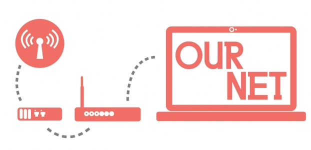

# Our Net

* Erica Kermani, [Eyebeam Atelier](http://eyebeam.org/), New York City, NY
* Collaborators: Dan Phiffer, Joanne McNeil

Our Net teaches middle school students a basic understanding of the key components of network infrastructure by enabling students to develop their own private internal networks that are independent of the Internet.

[Dan Phiffer](https://phiffer.org/), creator of Occupy.here and a volunteer sys op at Tilde.club, and [Joanne McNeil](http://www.joannemcneil.com/), former Eyebeam Resident, will lead students through the process of understanding online privacy, understanding the history and origins of the internet, and building their own networked environments. Students will build and experience a networked environment similar to online spaces from the 80s and 90s when early internet users took anonymity and privacy for granted. Youth will then be able to compare their experiences with the networks of their own creation to their experiences with the World Wide Web and commercial social networks like Facebook. Students will leave the workshops with enhanced digital literacy, an understanding of privacy on the internet, and knowing the history and origins of the internet as we know it today.

The program will also result in student materials and a teacher’s guide written for a non-technical person to understand.

This program series being held thanks to the Digital Media + Learning Competition 5 Trust Challenge! Eyebeam was one of thirteen institutions selected to receive part of the generous $1.2 million worth of funding from the Trust Challenge, a funding competition that seeks to advance trust, privacy, and equity within connected and contemporary educational contexts.
